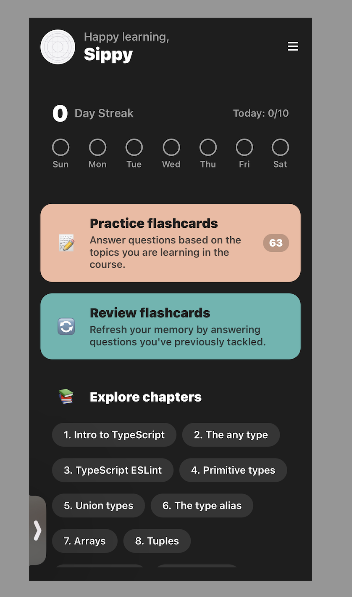

# Tech Quiz App

A React Native quiz application built with Expo, focusing on technical questions and clean architecture.

## Project Structure

```
src/
├── app/                    # Main application routes
│   ├── _layout.tsx        # Root layout with Stack navigation
│   ├── index.tsx          # Home screen
│   └── quiz.tsx           # Quiz screen
│
├── components/            # Reusable components
│   ├─
│   ├── ExploreCard.tsx
│   ├── PracticeCard.tsx
│   ├── ReviewCard.tsx
│   └── StreakCard.tsx
│
├── features/             # Feature-specific modules
│   └── quiz/            # Quiz feature
│       ├── components/  # Quiz-specific components
│       │   ├── QuestionCard.tsx
│       │   └── AnswerOption.tsx
│       └── types/      # Quiz-related types
│           └── types.ts
│
└── constants/            # Global constants and configurations
    ├── theme.ts         # Theme configuration and colors
    └── questions.ts     # Quiz questions data
```

## Screens:

#### Dashboard:

  

## Getting Started

1. Clone the repository
2. Install dependencies:

   ```bash
   npm install
   ```

3. Start the development server:
   ```bash
   npm start
   ```
